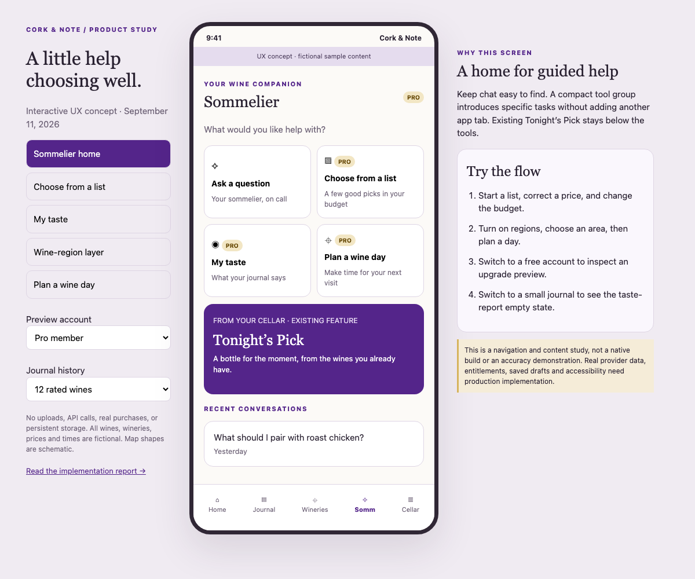

# Pro expansion: product, UX and implementation report

**Date:** September 11, 2026. **Decision requested:** adopt the feature sequence and UX below for follow-up implementation. **Status:** research and design proposal, with an [interactive UX concept](../design/pro-tools-concept-2026-09-11.html). The four proposed features are not implemented by this report.

This PR also includes the previously requested free winery discovery changes and updated future-insights policy wording. Those are implemented locally and are distinct from this proposed expansion. Existing prices and allowances remain unchanged.

## 1. Recommendation

Keep one Pro subscription at the current $9.99/month or $59.99/year while testing a clearer promise: **help me choose wine, understand my taste, and plan my next visit**. Ship four connected capabilities:

| Capability | Main entry point | First release scope | Priority |
|---|---|---|---|
| Choose from a wine list | Sommelier → Choose from a list | Photograph a list; confirm wines and prices; receive up to three choices within a budget | First paid feature |
| Wine regions | Wineries → Layers → Wine regions | Virginia AVA boundaries, named region sheets, and wineries located inside a selected boundary | First geographic feature |
| My taste | Sommelier → My taste; secondary Journal link | Evidence-based summary of the user's ratings and notes, with examples and suggested styles to explore | Next, sharing the preference foundation |
| Plan a wine day | Wineries → Plan a visit; secondary Sommelier shortcut | A saved, editable day with two or three stops, estimated travel and visit times, and external navigation | After regions and provider checks |

Keep free discovery, basic winery pages, directory websites, directions, visits, wishlists and unlimited tasting logs. Charge for the integrated planning and interpretation. Recommend Pro for the interactive region layer and region filtering, with a clearly marked sample for free users. Ordinary winery pins must remain visible when a layer is locked or fails.

The strongest initial purchase moment is selecting a bottle from a real list. Regions reinforce the wine-travel identity and have little marginal provider cost. A taste report creates a reason to return as the journal grows. The day planner is appealing but needs the most new factual infrastructure. These are product judgments, not measured conversion predictions.

## 2. Research and what we already have

### Market evidence

[Vivino's product guide](https://www.vivino.com/uk/wine-news/the-complete-guide-to-the-vivino-experience) describes both an AI Sommelier and a wine-list scanner. [InVintory's assistant page](https://invintory.com/ai-sommelier/) describes recommendations from a restaurant list matched to meal, budget and taste. Its [assistant help page](https://help.invintory.com/en/articles/14303285-meet-vincent-your-ai-wine-assistant) describes using collection reviews and a developing taste profile. These establish familiar user tasks; they do not prove demand or retention for Cork & Note. Our distinction should be guidance grounded in someone's tasting journal and winery visits, rather than promising a larger wine catalog.

### Code audit: reuse versus new work

| Existing component | What it already provides | Gap for this proposal |
|---|---|---|
| [`app/(tabs)/_layout.js`](<../../app/(tabs)/_layout.js>) | Home, Journal, Wineries, Somm, Cellar | No navigation reorganization needed |
| [`app/(tabs)/sommelier.js`](<../../app/(tabs)/sommelier.js>) | Conversation list, Tonight's Pick, photo questions, Pro entry | Add guided-tool entry points without putting forms in every chat |
| [`lib/ai.js`](../../lib/ai.js) | Journal context, image processing, cited responses and structured-block parsing | Context is capped at 20 recent tastings, 40 cellar entries and 12 visited places; it is not a whole-history taste model |
| [`lib/cellarScan.js`](../../lib/cellarScan.js) | Label and tasting-card extraction | Restaurant prices, serving sizes, corrections and candidate comparisons need a dedicated schema |
| [`supabase/functions/chat/index.ts`](../../supabase/functions/chat/index.ts) | Pro web search; images; Sonnet 4.6 chat and Haiku 4.5 scans; usage limits | Current 1,024/2,048 output-token caps and chat-shaped payload limits are unsuitable for long list extraction without changes |
| [`lib/wineryDirectory.js`](../../lib/wineryDirectory.js) | Independent winery coordinates, names and websites | No region membership, opening schedules or route engine |
| [`lib/places.js`](../../lib/places.js) | Pro Google details | Current open-now/weekday-text fields do not constitute a date-aware itinerary scheduler |
| [`lib/wineRegions.js`](../../lib/wineRegions.js) and [`lib/cellarRegion.js`](../../lib/cellarRegion.js) | Curated names, aliases and parent hints for cellar autocomplete | No polygons; the suggestion hierarchy is not authoritative spatial membership |

Photo questions and web search are **already implemented for Pro**. This proposal packages them into deliberate tasks. The server supplies a web-search tool only for eligible chat; the model chooses whether to invoke it. Source inspection and gate tests do not verify the currently deployed function or a live purchase account.

The older [region-model report](region-model.md) remains useful for distinguishing wine origin from winery location, but its statement that no reference data exists was superseded by the [September 9 reference-data implementation](region-reference-data.md).

## 3. UX architecture: tools with clear homes

Open the [self-contained interactive concept](../design/pro-tools-concept-2026-09-11.html) locally in a browser; on GitHub, download the HTML to interact with it. No installation or network access is required. A [region-layer screen capture](../design/pro-tools-regions-2026-09-11.png) is also available for quick review.

### Keep the five tabs

On the Sommelier root screen, place a compact **What would you like help with?** group above recent conversations:

1. **Ask a question** — ordinary chat remains one tap away and shows the free allowance when relevant.
2. **Choose from a list** — camera/list flow, with a Pro badge.
3. **My taste** — latest report or progress toward enough tastings.
4. **Plan a wine day** — opens the same planner reached from Wineries.

Tonight's Pick stays visible as an existing cellar feature. Use concise rows or a two-column grid on sufficiently wide screens; stack at large text sizes. Avoid four expanded feature cards above conversation history. Do not add a sixth tab or nest another tab bar inside Sommelier.

Wineries remains a map first: current pin filters, a **Layers** button, and **Plan a visit**. Layers opens a sheet with a **Wine regions** switch. Selecting a region opens its own sheet, not a chat answer. A planner opened from there receives the region selection. Journal gets a quiet **See your taste** link after sufficient ratings; Home may show one relevant recent result rather than four upgrade banners.

### Proposed routes and navigation contract

| Route | Purpose | Return behavior |
|---|---|---|
| `/sommelier/wine-list` | Capture and correct list | Back preserves local draft |
| `/sommelier/wine-list/[id]` | Saved choice results | Ask a follow-up opens chat with these specific choices |
| `/sommelier/taste` | Latest report and supporting tastings | Evidence links return to the original report |
| `/trips/new`, `/trips/[id]` | Plan and revisit a wine day | Shared route from Wineries and Sommelier |
| `/regions/[id]` or map sheet | Region explanation and winery filter | Close returns to the same map viewport |

These paths are proposed, not registered routes. The interactive concept demonstrates navigation and representative states with fictional wines, wineries, times and schematic geography. It makes no API calls or purchases.

### Free preview and paid activation

Show what the tool does before asking for camera permission or uploading data. Free users can inspect a labeled sample; **Use my list**, **Create my report**, **Build my day**, or **Explore regions** opens the relevant Pro offer. Do not generate a paid answer and then hide it behind a purchase screen. Keep the request draft and resume the exact task after entitlement refresh; cancellation returns to the draft. Continue to honor the separate AI-sharing choice even after purchase.

Saved user-authored plans and previously saved results stay readable after Pro expires. Generating new guidance, refreshing provider data, and interactive regional exploration require Pro. Do not persist restricted provider content merely to support that downgrade behavior.

## 4. Choose from a wine list

### Screen sequence

**Capture → Check the list → Choose preferences → Compare → Save or ask.**

- Capture: choose camera or library, with crop/retake. Start with at most three pages and 40 entries per request as a product limit to validate, not a provider maximum. Explain that an oversized list can be narrowed to the relevant section.
- Check: rows show producer, wine, vintage if printed, currency, glass/bottle or other serving size, and price. Flag uncertain text; allow edits and row removal. The photo stays available beside the extracted text. A missing price is unknown, never zero.
- Preferences: budget and serving size first; meal and style optional. Offer **Use my past ratings**, with **Just use these preferences** for a new journal or someone choosing for guests. Store money as integer minor units plus currency; do not silently convert.
- Compare: at most three distinct choices such as **Closest to your favorites**, **Try something new**, and **Lower-priced choice**. Categories apply only when supported. Each cites its actual list price and a short reason. No fabricated match percentage or invented critic score.
- Save: **Save choice** records the selected list entry; **Log this wine** opens the existing logging form with a draft. Neither action silently consumes a cellar bottle. **Ask why** starts a grounded follow-up.

### Reliable implementation

Separate extraction from recommendation. Use Haiku vision to extract text into validated JSON; use server-side deterministic budget/serving filters; then use Sonnet to explain a ranking drawn only from remaining entry IDs. A valid JSON shape is necessary but not proof that a wine or price was read correctly. Anthropic documents image limitations in [vision guidance](https://platform.claude.com/docs/en/build-with-claude/vision), and [structured outputs](https://platform.claude.com/docs/en/build-with-claude/structured-outputs) can constrain supported response schemas.

Proposed entry contract: `{entry_id, page_index, producer, wine_name, vintage, price_minor, currency, serving, uncertain_fields}`. Proposed result contract: `{recommendations: [{entry_id, reason, evidence_tasting_ids}], limitations}`. Reject unknown IDs and over-budget choices on the server after generation. Treat text in photos as untrusted content, never instructions to change the task or send data elsewhere.

The app currently scales AI photos to a 1,000-pixel longest edge. Small print may need cropping or a larger bounded menu-specific resolution. Evaluate this on real list photos before changing the general image pipeline. Use a dedicated output budget and explicit truncation detection; a 40-row list can exceed the current scan response ceiling. Do not splice an incomplete JSON response into a saveable result.

Web search is off for extraction and the first ranking: printed prices and the user's own notes are sufficient for that scope. A separately requested **Look up this wine** can use existing Pro web search with citations. It must not substitute a web price or a similarly named vintage for what is on the photographed list.

### Failure and empty states

No readable text → retake or type a few options. Ambiguous price columns → ask the user to confirm. No wines within budget → explain and offer changing budget; do not quietly exceed it. No personal history → preference-based choices labeled accordingly. Provider timeout → keep corrected entries for retry. Save only when the user chooses; delete temporary uploaded photos after processing unless the user explicitly saves them under a defined retention policy.

## 5. My taste

### User experience

Show **Based on 12 rated wines** with a date and three plain-language observations, each linked to supporting journal entries. Follow with two styles to explore. Do not characterize a person from one bottle or equate all cellar ownership with enjoyment.

Proposed starting rule: fewer than five distinct rated wines across two sessions shows a progress state; five or more can yield a **First impressions** report; ten across three sessions can yield a fuller report. These are UX thresholds to test, not statistically validated confidence levels. Never turn them into a precise taste-match score. Count distinct wines so repeated ratings of one favorite do not manufacture breadth.

Refresh only when the user asks and the relevant journal has changed. Show **New tastings since this report**. Preserve the last result offline; after a source entry is edited/deleted, mark the report out of date and invalidate its evidence appropriately. A report without enough qualifying data should show useful journal actions rather than a paywall for an empty product.

### How it works

Build a deterministic per-user summary from rated tastings: styles, grapes, user-entered sensory values, tagged flavors, recency and supporting IDs. Explicitly distinguish unknown fields, zero/unrated sentinels and valid ratings. Do not interpret region from the place a wine was tasted. Use a bounded, varied evidence sample across sessions rather than the current last-20-tastings context alone. Paginate source records and disclose the analyzed period if bounded.

One Sonnet request turns those aggregates into prose and suggested directions. Validate that every supporting ID belongs to that user and exists in the supplied evidence. Calculate counts and chart values in code, not with the model. Store `source_revision`, included IDs, analysis period and model/prompt version. A later change can invalidate one saved report without rewriting the journal.

Start with rated tastings, not a region-preference chart: wine-origin data is not consistently available across the tasting schema. The eventual aggregate preference service can also supply the list helper and planner, with clear fallback to explicit choices. It is not a winery-insights dataset and does not enroll the user in business reporting.

## 6. Wine-region polygons

### Names, sources and scope

Use **Wine regions** in the interface and explain **American Viticultural Areas (AVAs)** on the sheet. Start with Virginia and cross-border AVAs intersecting it, then expand to other U.S. regions. Do not imply worldwide coverage; European appellation boundaries need separate source and license work.

[TTB's AVA Map Explorer](https://www.ttb.gov/regulated-commodities/beverage-alcohol/wine/ava-map-explorer) offers boundary viewing and individual shapefile downloads. TTB says its maps are informational and the codified boundaries in 27 CFR part 9 take precedence. Its [established-AVA table](https://www.ttb.gov/regulated-commodities/beverage-alcohol/wine/established-avas) also lists cross-state AVAs and effective dates. Use those for verification, including checking whether a listed future effective date has arrived.

[UC Davis's data documentation](https://ucdavislibrary.github.io/ava/data.html) provides GeoJSON grouped by state and separates current from historical boundary versions. The repository's [CC0 license](https://github.com/UCDavisLibrary/ava/blob/5208ac65eeb9c3250945f1fa182b4f2ebb7756a9/LICENSE) permits commercial reuse of the waived rights. The documentation also includes an educational/as-is disclaimer, so use the geometry as an attributed informational dataset and reconcile it with TTB before release; do not describe it as a certified legal boundary service.

**Measured sample:** fetched the pinned [Virginia file](https://raw.githubusercontent.com/UCDavisLibrary/ava/5208ac65eeb9c3250945f1fa182b4f2ebb7756a9/avas_by_state/VA_avas.geojson) on September 11: 9 features, all MultiPolygon; 23,561 coordinate positions; 1,065,612 raw bytes and 381,113 bytes when gzip-compressed by the local Python check. The repository head inspected was commit `5208ac6`, dated December 10, 2025; that date does not prove current boundary accuracy. Several per-feature effective dates are null. See the [reproducible sample audit](ava-virginia-sample-2026-09-11.json).

The nine names match the seven single-state Virginia entries and two cross-state entries in the TTB listing inspected. This is a name/coverage check, not geometric verification. The app's curated-region comment currently says “all ten” although it lists nine AVAs plus Virginia itself; do not use that comment as a source for the overlay count. A statewide appellation is not another AVA polygon in this layer.

### Map interactions

Default the overlay off. Layers → Wine regions turns on low-opacity fills and readable borders beneath existing pins. Label only a few appropriate regions at the current zoom; selected borders become stronger. A bottom sheet shows the region name, designation, source/update date, **Wineries in this area**, and **Plan a visit here**. Allow changing or clearing the region selection independently of turning off the layer.

For overlapping or nested AVAs, offer a short chooser at the tapped point and parent/contained relationships when verified. Do not force each winery into exactly one region. Preserve cross-state geometry rather than clipping it at the Virginia border. Empty coverage says **Region boundaries aren't available here yet**, not **No wine region**. Region lists and search must provide an accessible alternative to polygon taps; color alone cannot communicate selection.

Use copy **Wineries located in Monticello AVA**. Never claim every wine from those wineries has Monticello origin. The existing [region-model analysis](region-model.md#6-why-not-derive-region-from-the-winery--the-owners-actual-question) explains the distinction. Keep a bottle's label/user-entered origin separate, and don't backfill `cellar_bottles.region` from tasting-room coordinates.

### Geometry and data pipeline

The installed `react-native-maps` version supports polygon coordinates, interior holes, fill/stroke styling and press handling; see [its versioned Polygon documentation](https://github.com/react-native-maps/react-native-maps/blob/v1.20.1/docs/polygon.md). Split MultiPolygon features into native Polygon components, retaining ring holes and a shared logical region ID. Convert GeoJSON `[longitude, latitude]` to the native coordinate shape.

Import pinned raw geometry into a separate region-boundary store, not into `lib/wineRegions.js`. Record source URL/commit, checksum, legal reference, fetched/verified dates, designation, status and effective interval. Keep canonical geometry for membership, simplified geometry for display. Validate closed rings, coordinate order, geometry validity and date status before publication. Add viewport bounding-box filtering, zoom-dependent simplification and stable component keys; profile panning alongside the existing clustered-marker lifecycle on physical iOS and Android devices.

For membership, use a PostGIS geometry index and [ST_Covers](https://postgis.net/docs/ST_Covers.html) against the original valid polygon so a point on a boundary is not automatically excluded. Store many-to-many `directory_region_memberships` keyed by boundary revision and directory coordinate revision. Use [ST_SimplifyPreserveTopology](https://postgis.net/docs/ST_SimplifyPreserveTopology.html) for display copies only; simplification can move edges. Near-boundary/low-confidence coordinates need an informational caveat and a correction path.

The current directory viewport query caps results at 750. A selected region's winery list and count need their own paginated membership query; never label that viewport subset “all wineries in this region.” Monthly source review plus change-triggered import is a reasonable initial operating plan, with a human check before promoting a new snapshot.

Pro gating is a product choice, not a restriction on ownership of public boundary facts. Recommend an authenticated entitlement-checked boundary/membership endpoint with account-scoped cache handling and a small ungated sample. Do not put the complete Pro data bundle in the free app and claim a client switch securely protects it. A saved plan remains readable after expiry; fetching/exploring new overlays does not.

## 7. Plan a wine day

### First version: a realistic, editable itinerary

Entry from Wineries or a region sheet opens a form for starting location (manual entry allowed), date, start/end time, two or three stops, and optional preferences. A **Saved wineries first** switch is valuable. Default to a modest day with visit duration and meal/buffer time; let the user change them. Do not infer accessible facilities, tasting prices, reservations or wines served from the directory alone.

Build a candidate shortlist from directory coordinates and region membership. Let the user choose/reorder stops. Retrieve date-relevant business hours for selected stops, obtain driving estimates, then compute the schedule in code. The model explains choices and suggests alternatives; it does not invent drive times, opening periods, or booking confirmations. Label unknown hours and reservation requirements explicitly. A preference cannot become a hard filter unless we have the underlying data.

The result is a timeline with travel legs, arrival/departure times, **Swap**, **Move**, **Remove**, and **Check winery website**. Reordering recalculates travel/schedule validity. Save the user's chosen stops and intended times; **Directions to next stop** opens the mapping app. This plans visits, not a drinking schedule: include a short transportation reminder and do not offer blood-alcohol estimates or promise safe driving after tastings.

### Provider and storage decisions

[Google Routes](https://developers.google.com/maps/documentation/routes/compute-route-matrix-over) can return travel distances and durations. Start with a fixed-order route for selected stops, not a matrix over hundreds of nearby wineries. A 10-by-10 matrix is 100 billed elements, not one cheap lookup. Handle impossible routes, winery-local time zones, daylight-saving transitions, special closures and appointment-only visits. The current Places response exposes weekday strings/open-now; add structured date-aware periods as needed instead of parsing display text as a schedule.

For v1, prefer a **mapless itinerary with external navigation**. Google's [Routes display policy](https://developers.google.com/maps/documentation/routes/policies) requires Google maps when route results are displayed on a map; [Places policies](https://developers.google.com/maps/documentation/places/web-service/policies) likewise constrain mapped provider content and caching. The existing iOS base map uses Apple Maps. Do not draw a Google route over it. An independently sourced AVA layer can remain on that map. A later embedded route preview would use a dedicated Google-backed map after a provider review.

Persist user-authored stops, notes and intended visit times, independent directory identifiers and permitted place IDs. Do not persist Google route polylines, fetched hours or derived provider summaries in generic saved JSON by default. Re-fetch eligible transient data when reopening online, with required attribution. Offline saved plans show the user's intended order/times and explicitly lack refreshed travel/hours. Review actual provider terms for the release and billing region before promising downloadable live travel information.

## 8. Shared implementation and entitlements

Add reusable `SommelierToolCard`, `ProFeaturePreview`, `GuidedTaskShell`, `EvidenceWineLink` and a saved-result list, reusing theme, headers, sheets and existing forms. Share one planner route across entry points. Show task-specific loading stages, keep local drafts on network errors, and support cancellation without duplicate saves or duplicate billed retries.

Proposed separate endpoints: `wine-list` (extract/recommend operations), `taste-report`, `trip-plan`, and `wine-regions`. Reuse entitlement and AI-consent checks, but define task contracts/models/prompts server-side. Do not trust a client-supplied task name to choose a cheap model or bypass a paid gate. Preserve the existing chat API for older clients.

Proposed additive tables:

| Table | Content and access |
|---|---|
| `wine_list_sessions` | Owner ID, corrected entries, selected results, version and optional retained user photo reference; owner RLS |
| `taste_reports` | Owner ID, evidence IDs/source revision, computed aggregate summary and explanation; owner RLS |
| `trip_plans` / `trip_stops` | Owner ID, user-selected directory/winery IDs, intended times, notes and order; owner RLS |
| `wine_region_boundaries` / `directory_region_memberships` | Versioned independent geometry and membership; reviewed imports; controlled read endpoints |
| `feature_usage` | Task, request/idempotency ID, reservation/completion status, token/provider usage; server writes |

Add deletion/cascade behavior and account-switch cache isolation with each table. A privacy/terms update is needed if the new photo retention or provider flows change actual practice; the future winery-insights opt-in remains separate.

Meter complete operations with atomic reservations and idempotency keys. Concurrent retries must not both evade limits. Reserve a bounded budget before provider work; reconcile failures and actual costs afterwards. Proposed beta ceilings: 5 list sessions/day and 30/month; 1 taste refresh/day and 4/month when source data changed; 3 trip builds/day and 10/month. Edits and viewing saved work are free of generation meters. Validate these proposed numbers with observed behavior before setting customer promises. A global per-account provider-spend guard must cover chat and all new tasks together; separate feature caps alone can sum to an expensive account.

## 9. Cost model and subscription fit

Published rates checked September 11: Sonnet 4.6 $3 input/$15 output per million tokens; Haiku 4.5 $1/$5; web search $0.01 per search plus tokens. [Anthropic pricing](https://platform.claude.com/docs/en/about-claude/pricing). Google's first paid global tiers list Details Enterprise at $0.02/request, Text Search Pro $0.032/request, and Routes Essentials $0.005/request or matrix element, after SKU-specific free allowances. [Google pricing](https://developers.google.com/maps/billing-and-pricing/pricing).

**Illustrative variable costs, not measurements or maximums:** assume no discounts, no free allowances, no retries, and image tokens included in input totals.

| Operation | Explicit example | Approximate cost |
|---|---|---|
| List extraction + ranking | Haiku 5k input/2k output ($0.015), Sonnet 4k input/1k output ($0.027) | $0.042 |
| Taste report | Sonnet 6k input/1k output | $0.033 |
| Three-stop day | Three Details calls ($0.06), one fixed-order Essentials route ($0.005), Sonnet 4k/1k ($0.027) | $0.092; about $0.188 if three paid matches are also needed |
| Region overlay | Our own versioned geometry | No Google/AI fee; database, transfer, storage and maintenance still apply |

Ten list sessions, two reports and two newly matched three-stop days would add about **$0.862/month** in this example, before existing chat/scans, retries, hosting, billing fees and support. This is a scenario, not average-user evidence. Annual subscribers yield only about $5 gross/month; budget against that as well as the monthly plan. Measure total costs and contribution after actual store fees. Heavy use can defeat these economics even at apparently generous daily limits.

One existing assumption needs correction before relying on older budgets: the Places matching field mask requests display names and addresses, so it is not an IDs-only free search; those fields trigger Text Search Pro. [Google field/SKU reference](https://developers.google.com/maps/documentation/places/web-service/text-search). The existing comment/cost-model correction is follow-up work, not changed by this report.

Avoid promising “unlimited” new multi-step tools before measuring them. During the beta, show concrete included allowances in the tool and paywall. Keep the subscription structure stable while evaluating the feature value.

## 10. Delivery plan and acceptance criteria

Effort ranges below are planning estimates for one engineer familiar with the repository, including meaningful tests and device QA. They are not commitments; source reconciliation, app-store work and live provider configuration can extend them. Approximately **4–6 engineering weeks** for all phases, excluding review waiting time, is a more useful planning range than calling all four features simple wrappers.

| Phase | Deliverable | Estimate | Release gate |
|---|---|---|---|
| 0 | Validate this prototype with 5–8 target users; baseline event plan, server task contracts and cost accounting | 2–3 days | Users can find each tool without coaching; drafts survive purchase cancellation |
| 1 | List capture, correction, ranking, save/log and Pro access | 5–7 days | No unknown IDs or unchecked over-budget picks; readable error states; live Pro vision check |
| 2 | Verified Virginia boundary import, map layer, sheet and paginated winery membership | 3–5 days | No wine-origin backfills; cross-state/multipart/overlap cases; physical-device map performance |
| 3 | Taste aggregates, evidence links, first-impressions/full states and source invalidation | 3–5 days | All claims trace to current user evidence; no unrated/duplicate inflation |
| 4 | Date-aware editable itinerary, route estimates, saving and external navigation | 5–8 days | No fabricated hours/times; provider attribution/display review; timezone and offline cases |

Ship behind separate feature flags. Start list beta first; promote region coverage only after data checks. Phase 3 may precede Phase 2 if geometry quality becomes the bottleneck. Stop adding scope to a phase once its core task works.

Evaluation should include a consented set of roughly 30–50 list photos covering low light, multiple currencies, glass/bottle columns, missing vintages and large menus. Measure extraction accuracy separately from recommendation usefulness. Test expired Pro, AI-sharing declined, denied GPS/camera, account switching, source deletions, quota errors, concurrent retries, malformed/truncated responses and photo prompt injection. For geometry test holes and nested regions even though the Virginia sample has no interior holes; include boundary points and coordinates near a border.

Use first-use task completion and subsequent use as product measures, alongside tool-preview → upgrade → successful result. Record feature, entry surface, completion/error type, elapsed time, usage bucket and purchase outcome without menu photos or journal text in analytics. Compare cohorts and avoid treating conversion alone as success if refunds, failures or cancellations rise. Do not quote a target uplift without enough users to support it.

## 11. Decisions that can wait

Global region coverage, restaurant reservations, automatic booking, live merchant price comparison, affiliate checkout, group trip collaboration, background weekly reports and winery business dashboards are outside v1. They introduce separate data and operational needs. The optional buy-again shortlist remains a later idea, not one of the three accepted guided tools.

Proceed with these working defaults: one Pro tier; list helper first; Virginia overlays; tools on Sommelier plus contextual entry points; saved results readable after expiry; no new limits on manual journaling. Review the prototype before starting production implementation of these four features.

## 12. Verification performed for this report

Checked the current code paths above, primary-source documentation and pricing, and the pinned Virginia dataset. Checked report-relative file links and the sample audit's geometry counts. Browser-tested the concept's budget filtering and empty result, region-to-planner navigation, demo save state, free upgrade/resume, taste-report empty state, and lack of horizontal page overflow at 390px. Inspected the desktop and region screenshots; no browser script errors remained. This does not validate OCR accuracy, real recommendations, actual routes, native polygon performance, production entitlements or legal boundary accuracy; those require the implementation and release checks specified above.
